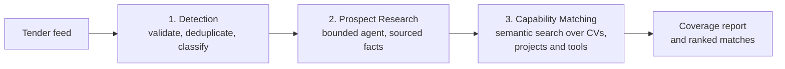
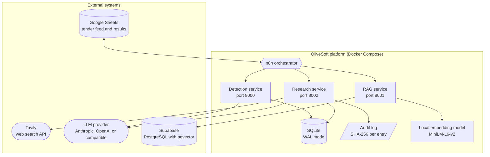
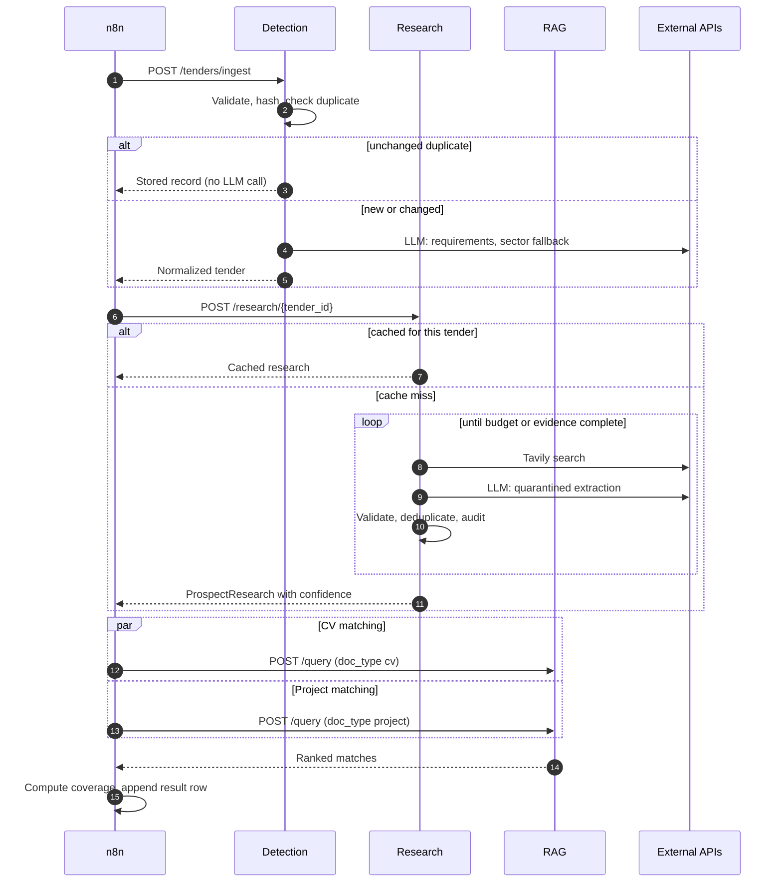
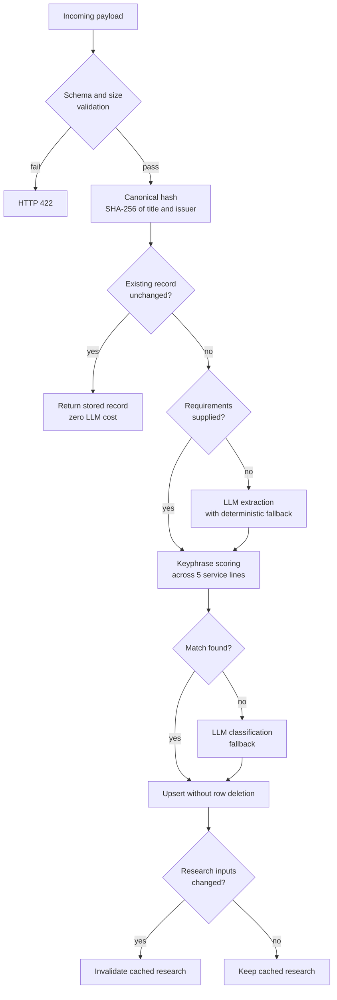
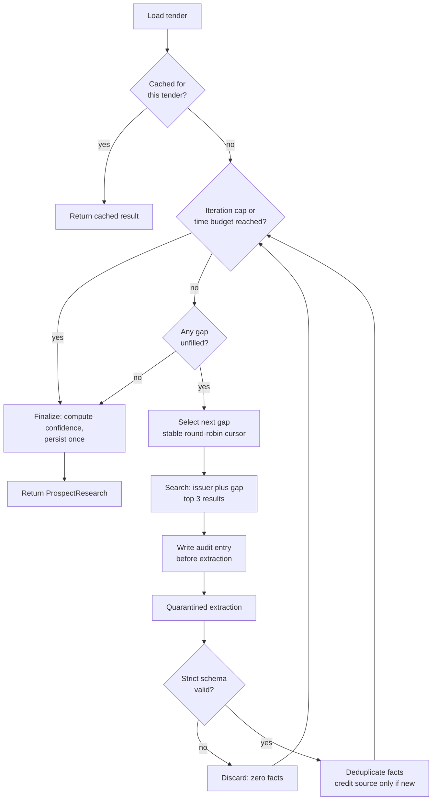
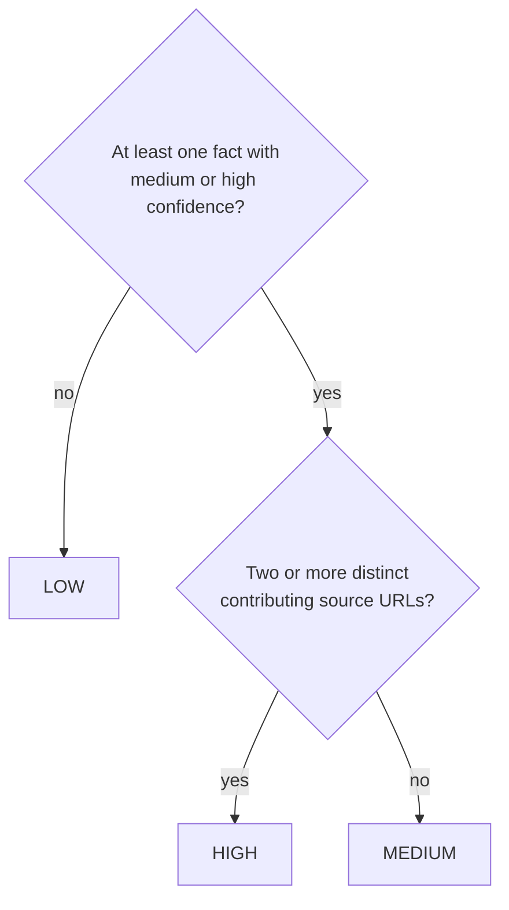
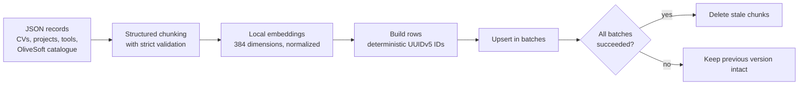
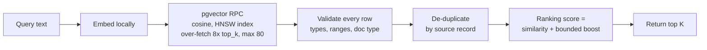
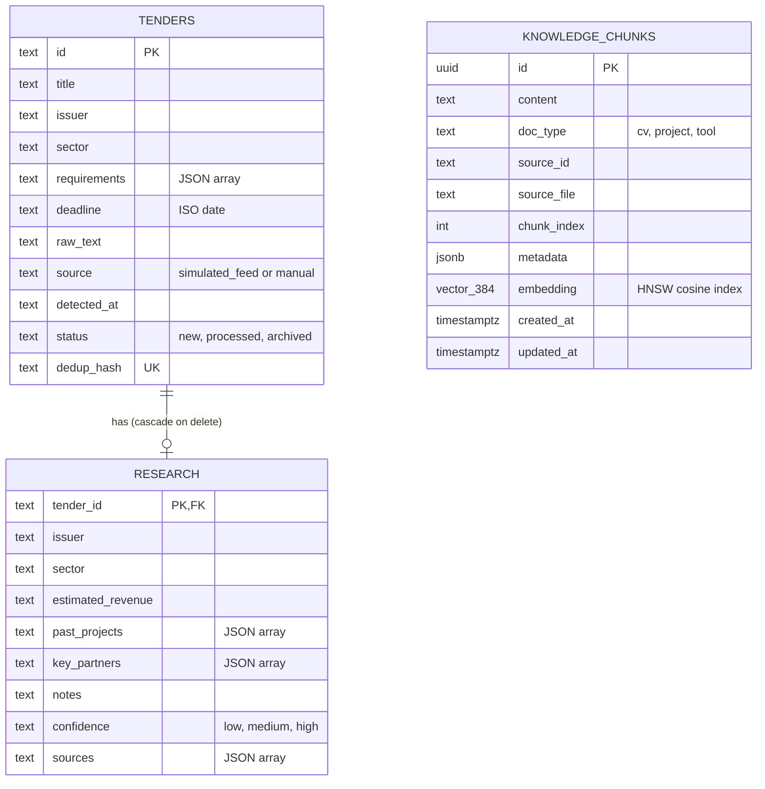
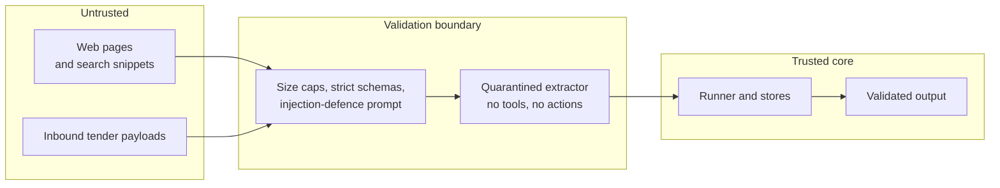

# OliveSoft RFP Intelligence Platform

**Automated tender detection, prospect research and capability matching, with security and auditability built into the design.**

| | |
|---|---|
| **Status** | Phase 1 complete |
| **Runtime** | Python 3.11, FastAPI, Docker Compose |
| **Data stores** | SQLite (transactional), Supabase pgvector (semantic) |
| **Orchestration** | n8n |

---

## Table of Contents

1. [Executive Summary](#1-executive-summary)
2. [Problem Statement](#2-problem-statement)
3. [Solution Overview](#3-solution-overview)
4. [System Architecture](#4-system-architecture)
5. [Component Design](#5-component-design)
6. [Data Model](#6-data-model)
7. [Security Architecture](#7-security-architecture)
8. [Reliability and Performance](#8-reliability-and-performance)
9. [Quality Assurance](#9-quality-assurance)
10. [Getting Started](#10-getting-started)
11. [API Reference](#11-api-reference)
12. [Configuration](#12-configuration)
13. [Repository Structure](#13-repository-structure)
14. [Roadmap]

---

## 1. Executive Summary

Responding to a request for proposal (RFP) requires three things that are slow when done by hand: understanding what the buyer is asking for, understanding who the buyer is, and proving that the company has the people and track record to deliver.

This platform automates all three. A tender enters the system and leaves as a structured, evidence-backed brief: a classified requirement set, a sourced profile of the issuing organization, and a ranked shortlist of the CVs, past projects and capabilities that best match the request.

**Key outcomes**

| Outcome | How it is achieved |
|---|---|
| Faster bid qualification | Three chained services replace manual reading, web research and internal search |
| Trustworthy AI output | Every research fact is sourced, schema-validated and scored by a deterministic confidence rule |
| Controlled cost | Hard iteration, time and size budgets on every LLM and search call; duplicate work is never repeated |
| Safe to operate | Untrusted web content is quarantined; all actions are logged in a tamper-evident audit trail |
| Verifiable quality | 155 automated test functions, four security scanners in CI, and a labelled retrieval benchmark |

---

## 2. Problem Statement

| Pain point | Consequence |
|---|---|
| Tenders arrive in unstructured text of varying quality | Analysts spend hours extracting requirements and judging fit |
| Buyer research is manual and inconsistent | Bid decisions rest on incomplete or unsourced information |
| Internal expertise is scattered across CVs and project records | The strongest evidence of capability is often not found in time |
| Generic AI tooling offers no provenance | Stakeholders cannot verify, and therefore cannot trust, machine-generated claims |
| Agents that read the open web are an attack surface | A single malicious page can manipulate output or leak data |

---

## 3. Solution Overview

### 3.1 Pipeline



### 3.2 Capabilities

| Stage | Input | Output |
|---|---|---|
| **Detection** | Raw tender payload (title, issuer, deadline, text) | Validated, de-duplicated record with requirements and a service-line classification |
| **Research** | A stored tender | Issuer profile: sector, estimated revenue, past projects, key partners, sources, confidence |
| **Matching** | Tender text plus research context | Top-K CVs and projects ranked by semantic similarity with a bounded business priority |

OliveSoft's five service lines used for classification: Data Integration, AI Development, BI and Dashboarding, Salesforce Ecosystem, Data Platform.

---

## 4. System Architecture

### 4.1 Context diagram



### 4.2 Services

| Service | Port | Responsibility | Depends on |
|---|:---:|---|---|
| Detection | 8000 | Validate, deduplicate, extract requirements, classify | SQLite, LLM (fallback only) |
| Research | 8002 | Agentic issuer profiling with quarantined extraction | SQLite, Tavily, LLM, audit log |
| RAG | 8001 | Embed query, vector search, rank, validate results | Supabase, local embedding model |
| n8n workflow | n/a | Schedule, loop over tenders, chain services, write results | The three services above |

All services expose `GET /health` without authentication. Every other endpoint requires the `X-Internal-Token` header.

### 4.3 End-to-end sequence



---

## 5. Component Design

### 5.1 Detection service



**Design decisions**

| Decision | Rationale |
|---|---|
| Validate before any database or LLM work | Bad input never spends budget |
| Canonical natural key (whitespace-collapsed, case-folded) | Cosmetic edits and workflow retries do not create duplicates |
| Keyword classification first, LLM second | Deterministic, free and explainable in the common case |
| Tie-break by declared taxonomy order, plus an import-time drift guard | Classification is reproducible; configuration drift fails fast |
| `ON CONFLICT DO UPDATE` instead of `INSERT OR REPLACE` | The latter performs a delete, which cascades and silently destroys stored research |
| Selective cache invalidation | A deadline-only change does not force an expensive re-research |
| Deterministic fallback when the LLM is unavailable | Ingest degrades gracefully instead of returning a 500 |

**Enforced limits:** `raw_text` 20,000 characters, title 300, issuer 200, requirement 1,000, at most 100 requirements.

### 5.2 Research service

The research runner is a bounded agent. It fills four evidence gaps (sector, estimated revenue, past projects, key partners) using web search, and routes every snippet through a quarantined extractor.



**Quarantined extractor**

The extractor is the only component that sees untrusted web text, and it has no authority to act.

| Property | Implementation |
|---|---|
| Channel separation | Trusted instructions on the `system` channel; untrusted text in the user message, never concatenated |
| Bounded input | Snippet capped at 4,000 characters before it reaches the model |
| Strict output contract | `extra="forbid"`, strict types, categories restricted to a fixed enum |
| Fail-closed | Any deviation yields zero facts rather than partial or altered facts |
| Bounded output | Fact value at most 500 characters; at most 8 facts per page |
| Drift visibility | Contract violations are logged, so a model format change is observable; `llm_contract_probe` tests this against a live model |

**Deterministic confidence**

Confidence is computed from evidence. The model never reports its own confidence for the final result.



Repeated facts are de-duplicated and do not credit their URL as an additional source, so echoing one claim across many pages cannot inflate confidence. Conflicting sector claims are recorded in the `notes` field.

**Caching.** Results are keyed by tender, not issuer. Unchanged retries are free, and opportunity-specific evidence never leaks between two RFPs from the same buyer.

### 5.3 RAG service

#### 5.3.1 Ingestion



| Property | Detail |
|---|---|
| Idempotent | Chunk ID is `uuid5(source_id, chunk_index)`; re-ingesting converges to the same rows |
| Failure-safe | Stale rows are removed only after every upsert succeeds; replacing a source with zero chunks is refused |
| Model work first | All embedding completes before the database is touched |
| Honest provenance | Catalogue entries retain status (for example `proposed`) and are never presented as completed deliveries |

#### 5.3.2 Query and ranking



**Ranking policy.** OliveSoft-owned projects receive a priority boost capped at 0.10 and applied only after semantic retrieval. A strongly relevant result therefore cannot be outranked by an unrelated internal record, and the policy is transparent and reproducible.

**Over-fetching** ensures that several chunks from one CV do not crowd other candidates out of the final top K.

---

## 6. Data Model



`TENDERS` and `RESEARCH` live in SQLite (WAL mode, foreign keys on, connections always closed). `KNOWLEDGE_CHUNKS` lives in Supabase and is unique on `(source_id, chunk_index)`.

---

## 7. Security Architecture

### 7.1 Trust boundaries



### 7.2 Threats and controls

| Threat | Control | Evidence |
|---|---|---|
| Prompt injection via web content | System/user channel separation, strict output schema, zero-fact fail-closed behaviour, snippet and fact caps | 25 dedicated injection tests |
| Inflated confidence via hijacked output | Confidence computed from distinct sources; duplicate facts do not add sources | End-to-end compromised-extractor test |
| Audit log forgery | Untrusted text escaped to a single line before hashing; per-entry SHA-256; per-run correlation ID | Log-forgery tests |
| Credential leakage in logs | Secret scrubber attached to the logger, covering message and traceback; sensitive parameter names redacted in the audit log | Redaction tests |
| Server-side request forgery | http/https only; DNS-resolved private, loopback, link-local and reserved ranges blocked; redirects never followed; 256 KiB body cap | SSRF tests |
| Token guessing by timing | Constant-time comparison; unset token fails closed | Auth tests |
| Malformed or oversized input | Strict Pydantic models, `extra="forbid"` on request bodies, bounds on every field | Schema and normalization tests |
| Direct database access | Row-level security enabled; search function is `security invoker` with pinned `search_path`; privileges revoked from `public`, `anon`, `authenticated` | `sql/schema.sql` |
| Vulnerable or leaked dependencies | CI runs gitleaks, Bandit, Semgrep and pip-audit; GitHub Actions pinned to commit SHAs; weekly scheduled scan | `.github/workflows/security.yml` |
| Container compromise | Non-root runtime user; pinned base image; locked dependencies | `Dockerfile`, `requirements.lock` |

### 7.3 Audit log entry format

```
<UTC timestamp> | INFO | <tool_name> | <params JSON incl. run_id> | <sha256> | <content, single line, capped>
```

Logs rotate daily with 365 days of retention, handled inside the application rather than by host configuration.

---

## 8. Reliability and Performance

### 8.1 Time budget

The server-side budget is set below the orchestrator's client timeout so the workflow never abandons a run that is still spending money.

| Limit | Value | Note |
|---|:---:|---|
| n8n research node timeout | 45 s | Client side |
| Total research run budget | 35 s | Configurable |
| Per-call timeout | 8 s | Search and LLM |
| Worst case | about 43 s | 35 s plus one in-flight call |
| Search iterations | 6 | Configurable |
| Results processed per query | 3 | Enforced in both tool and runner |

### 8.2 Failure handling

| Failure | Behaviour |
|---|---|
| LLM transient error (5xx, network) | One retry with backoff |
| LLM client error (4xx) | Fail fast; misconfiguration is never disguised as a result |
| LLM unavailable during ingest | Deterministic sentence-based requirement extraction |
| Search exhaustion | Degrades to an empty result; the run continues |
| One extraction fails | That snippet is skipped; the run continues |
| Embedding or upsert failure | Previous knowledge-base version remains intact |
| Read-only container filesystem | Audit log path falls back to a writable temporary directory |
| Duplicate request or retry | Served from storage or cache; no repeated spend |

---

## 9. Quality Assurance

| Area | Detail |
|---|---|
| Automated tests | 155 test functions across detection (22), research (62), RAG (41) and shared modules (30), including n8n workflow structure checks |
| Hermetic execution | Every provider call is mocked and CI supplies no real credentials, so tests cannot spend money or leak keys |
| Security regression | Prompt injection, SSRF, log forgery and secret leakage are each covered by dedicated tests |
| Retrieval benchmark | 13 labelled cases reporting Precision@K, Recall@K and Mean Reciprocal Rank, with a configurable recall gate (default 0.70) |
| Continuous integration | Unit tests per module on every push and pull request, plus four independent security scanners |

```bash
pip install -r requirements.txt
pytest detection research shared rag     # unit tests
python -m rag.evaluate_local             # retrieval benchmark, no database required
```

---

## 10. Getting Started

**Prerequisites:** Docker with Compose, a Supabase project, and API keys for an LLM provider and Tavily.

**Step 1. Configure the environment**

```bash
cp .env.example .env
# Set: INTERNAL_SERVICE_TOKEN, LLM_API_KEY, TAVILY_API_KEY,
#      SUPABASE_URL, SUPABASE_SERVICE_KEY
```

**Step 2. Create the vector schema.** Run `sql/schema.sql` in the Supabase SQL editor.

**Step 3. Start the services**

```bash
docker compose up --build
```

**Step 4. Load the knowledge base**

```bash
docker compose --profile tools run --rm rag-ingest
```

**Step 5. Verify end to end**

```bash
export TOKEN="$INTERNAL_SERVICE_TOKEN"

# Load the simulated tender feed
curl -X POST localhost:8000/tenders/seed -H "X-Internal-Token: $TOKEN"

# Run prospect research on one tender
curl -X POST localhost:8002/research/tender-001 -H "X-Internal-Token: $TOKEN"

# Retrieve the best-matching CVs
curl -X POST localhost:8001/query \
  -H "X-Internal-Token: $TOKEN" -H "Content-Type: application/json" \
  -d '{"text":"MuleSoft integration with master data management","top_k":5,"doc_type":"cv"}'
```

The orchestration workflow is in `n8n/workflows/` and ships inactive.

---

## 11. API Reference

| Service | Method and path | Description |
|---|---|---|
| Detection | `POST /tenders/ingest` | Validate, deduplicate, classify and store a tender. Returns 422 on invalid input |
| Detection | `GET /tenders` | List tenders; optional `status` filter |
| Detection | `GET /tenders/{id}` | Fetch one tender; 404 if absent |
| Detection | `POST /tenders/seed` | Load the bundled simulated feed; a malformed file is reported, not fatal |
| Research | `POST /research/{tender_id}` | Run or serve cached prospect research |
| Research | `GET /research` | List all stored research |
| Research | `GET /research/{tender_id}` | Fetch stored research; 404 if absent |
| RAG | `POST /query` | Semantic search (see request schema below) |
| All | `GET /health` | Liveness probe, unauthenticated |

Research is a `POST` by design: a run spends search and LLM budget, so it must never be triggered by crawlers, prefetchers or browser retries.

**RAG query request**

| Field | Type | Constraint | Default |
|---|---|---|---|
| `text` | string | 3 to 10,000 characters | required |
| `top_k` | integer | 1 to 20 | 5 |
| `doc_type` | string | `cv`, `project` or `tool` | none (all types) |
| `similarity_threshold` | number | 0.0 to 1.0 | 0.0 |

**RAG query response item:** `id`, `content`, `doc_type`, `source_file`, `metadata`, `similarity`, `ranking_score`.

---

## 12. Configuration

| Variable | Purpose | Default or example |
|---|---|---|
| `INTERNAL_SERVICE_TOKEN` | Shared secret for service authentication | Required |
| `LLM_PROVIDER` | `anthropic`, `openai` or `ollama` (any OpenAI-compatible endpoint) | `anthropic` |
| `LLM_MODEL` | Model identifier | `claude-3-5-haiku-20241022` |
| `LLM_API_KEY` | Provider credential | Required |
| `LLM_URL` | Endpoint for OpenAI-compatible providers | Optional |
| `TAVILY_API_KEY` | Web search credential | Required for research |
| `MAX_SEARCH_ITERATIONS` | Research loop cap | 6 |
| `TOTAL_RUN_TIMEOUT_SECONDS` | Research run budget | 35 |
| `PER_CALL_TIMEOUT_SECONDS` | Timeout per search or LLM call | 8 |
| `SUPABASE_URL` | Vector database URL | Required for RAG |
| `SUPABASE_SERVICE_KEY` | Server-side database key | Required for RAG |
| `EMBEDDING_MODEL` | Sentence-transformers model | `sentence-transformers/all-MiniLM-L6-v2` |
| `OLIVESOFT_DB_PATH` | SQLite file location | Container: `/data/olivesoft.db` |
| `RESEARCH_AUDIT_LOG` | Audit log path | Container: `/data/research.log` |
| `FETCH_MAX_BYTES` | Fetch tool body cap | 262144 |

Secrets must be supplied through the environment and never committed.

---

## 13. Repository Structure

```
.
├── detection/            Tender ingestion, normalization, classification
│   └── data/simulated_feed/   15 sample tenders
├── research/             Agentic prospect research
│   ├── runner.py         Bounded orchestration loop and confidence rule
│   ├── extractor.py      Quarantined LLM extraction
│   ├── audit.py          Tamper-evident audit logger
│   ├── search.py         Tavily client with timeouts and retry policy
│   └── tools/            SSRF-guarded fetch, LLM contract probe
├── rag/                  Semantic retrieval service
│   ├── structured_chunking.py   Record-aware chunkers
│   ├── ranking.py        Bounded priority policy
│   ├── storage.py        Failure-safe replace logic
│   └── evaluate_local.py Offline retrieval benchmark
├── shared/               Auth, schemas, SQLite store, log redaction
├── sql/schema.sql        pgvector schema, indexes, RLS, search function
├── n8n/workflows/        Phase 1 orchestrator
├── Cvs dataset/          Synthetic knowledge base (see below)
├── .github/workflows/    Test and security pipelines
├── Dockerfile
└── docker-compose.yml
```

**Bundled data (synthetic).** 20 CVs, 12 projects, 6 capability records and a 36-entry OliveSoft project catalogue. No real personal data is included.

---

### 14.1Roadmap 

| Phase | Scope | Status |
|---|---|---|
| 1 | Detection, research, matching, orchestration, security hardening | Complete |
| 2 | Commercial proposal generation service | Scaffolded, not enabled |
| 3 | Per-caller identity, token rotation, rate limiting | Planned |
| 4 | Richer ranking signals (CV banks, repeat-client portfolios, tool fit) | Planned |
