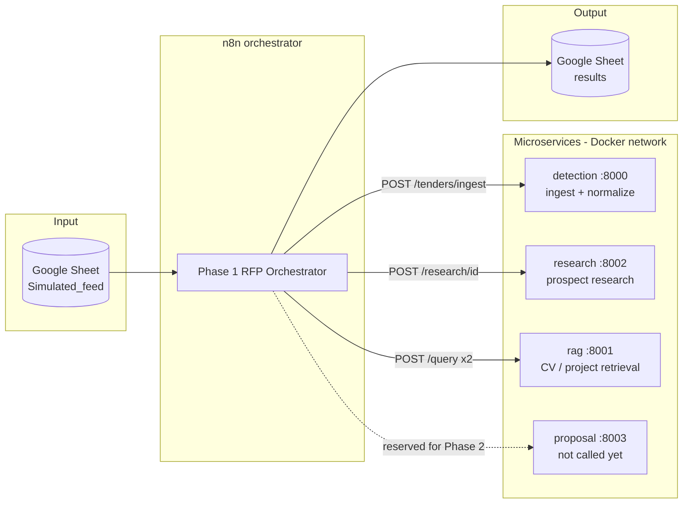
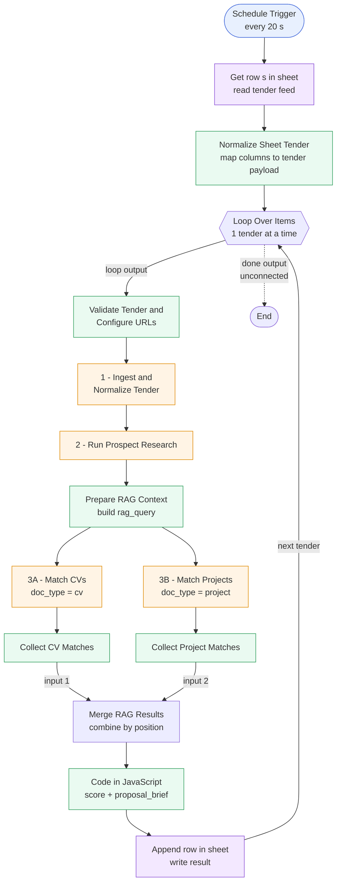
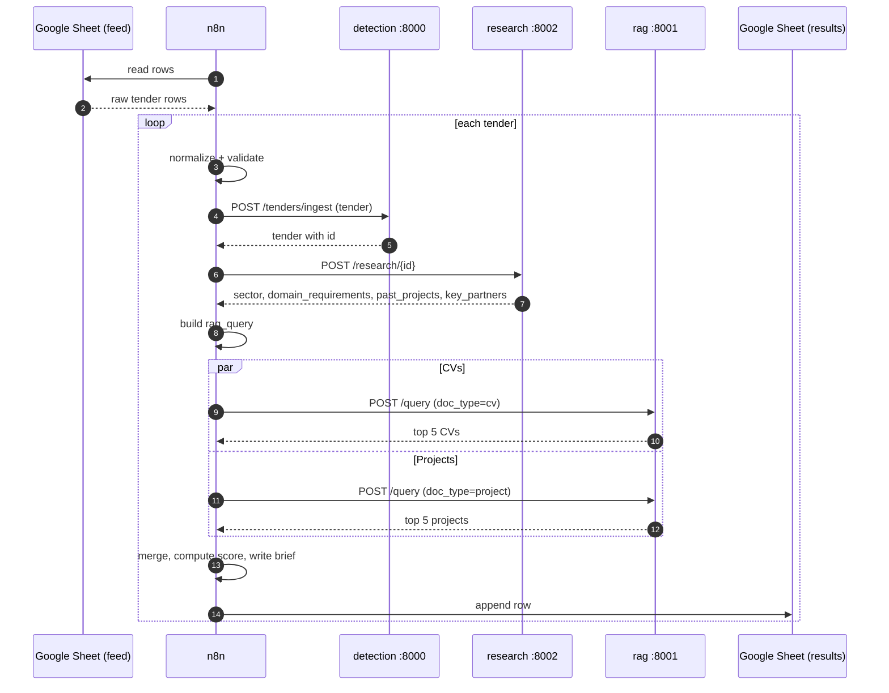

# OliveSoft – Phase 1 RFP Orchestrator (n8n)

An n8n workflow that takes tenders (RFPs) from a Google Sheet feed, sends each one through a chain of microservices (ingestion → prospect research → RAG matching), and writes a short **coverage score + proposal brief** to a results sheet.

It is the **orchestration layer** of the Automated RFP Intelligence system: it contains almost no business logic itself, it just validates input, calls the services in the right order, merges their answers and scores the result.

---

## 1. Big picture



The four service URLs are defined in **one place** (the first Code node), so changing an environment (Docker → cloud) means editing a single object.

---

## 2. Workflow diagram



Legend: 🟠 HTTP call to a microservice · 🟢 Code node (JavaScript) · 🟣 Google Sheets · 🔵 trigger.

---

## 3. Step-by-step

| # | Node | Type | What it does |
|---|------|------|--------------|
| 0 | **Schedule Trigger** | Schedule | Fires every **20 seconds** (demo/testing value). |
| 1 | **Get row(s) in sheet** | Google Sheets | Reads all rows of the `Simulated_feed` sheet (the fake tender feed). |
| 2 | **Normalize Sheet Tender** | Code | Converts each row into the tender shape. Accepts several column spellings (`title`/`Title`, `description`/`raw_text`/`tender_text`, …), splits the requirements cell on newlines or `;`, sets `source = "simulated_feed"`, and wraps everything under `body` to mimic a Webhook payload. |
| 3 | **Loop Over Items** | Split In Batches | Processes tenders **one at a time**; the last node loops back here to fetch the next one. |
| 4 | **Validate Tender and Configure URLs** | Code | Strict input validation, then outputs `{ tender, config }` where `config` holds the 4 service URLs. |
| 5 | **1 - Ingest and Normalize Tender** | HTTP POST | `detection /tenders/ingest` — stores/normalizes the tender and returns it with an `id` (and possibly a `sector`). |
| 6 | **2 - Run Prospect Research** | HTTP POST | `research /research/{id}` — agentic prospect research; returns `sector`, `domain_requirements`, `past_projects`, `key_partners`. |
| 7 | **Prepare RAG Context** | Code | Builds one text query from the tender title/sector/requirements + the research results (capped at 10 000 chars). |
| 8 | **3A - Match CVs** / **3B - Match Projects** | HTTP POST (parallel) | `rag /query` with `top_k = 5`, `similarity_threshold = 0.20`, once with `doc_type: "cv"` and once with `doc_type: "project"`. |
| 9 | **Collect CV / Project Matches** | Code | Flattens the response into `{ cv_matches }` / `{ project_matches }`, dropping items without an `id`. |
| 10 | **Merge RAG Results** | Merge | Combines both branches into a single item (by position). |
| 11 | **Code in JavaScript** | Code | Computes the coverage score and builds the proposal brief (see §5). |
| 12 | **Append row in sheet** | Google Sheets | Appends `tender_title`, `overall_coverage_score`, `proposal_brief` to the results sheet, then loops back. |

---

## 4. One tender, end to end



---

## 5. Data contracts

### 5.1 Tender payload (what the Validate node accepts)

| Field | Type | Rules |
|-------|------|-------|
| `title` | string | required, non-empty |
| `issuer` | string | required, non-empty |
| `deadline` | string | required, real date, format `YYYY-MM-DD` |
| `raw_text` | string | required, non-empty, **max 20 000 characters** |
| `requirements` | string[] | optional, every entry a non-empty string |
| `source` | string | optional, `manual` (default) or `simulated_feed` |
| `id`, `detected_at` | string | optional, passed through if present |

Any violation throws `Invalid tender: …` with the reason.

### 5.2 Feed sheet columns (input)

`id`, `title`, `issuer`, `deadline`, `description` (or `raw_text`), `requirements` (newline- or `;`-separated).

### 5.3 Result sheet columns (output)

| Column | Example |
|--------|---------|
| `tender_title` | `Cloud migration for Ministry X` |
| `overall_coverage_score` | `0.47` |
| `proposal_brief` | `Cloud migration … (Ministry X, deadline 2026-11-30). Matched 5 CVs (…) and 5 projects (…).` |

### 5.4 Coverage score

```
score_cv       = average similarity of the matched CVs
score_projects = average similarity of the matched projects
overall        = round( (score_cv + score_projects) / 2 , 2 )
```

The similarity field is read from `similarity`, `score` or `similarity_score` (whichever the RAG service returns). Empty lists count as `0`.

---

## 6. Requirements to run it

**Services** (reachable from the n8n container by these hostnames):

| Service | URL | Endpoint(s) used |
|---------|-----|------------------|
| detection | `http://detection:8000` | `POST /tenders/ingest` |
| research | `http://research:8002` | `POST /research/{id}` |
| rag | `http://rag:8001` | `POST /query` |
| proposal | `http://proposal:8003` | *configured, not used yet* |

**n8n credentials:**

- `Header Auth` (HTTP Header Auth) — attached to all 4 HTTP Request nodes.
- `Google Sheets account` (Google Sheets OAuth2) — used for reading the feed and appending results.

**Google Sheets:** one sheet as the tender feed (`Simulated_feed`) and one for results.

**Setup:**

1. In n8n: *Workflows → Import from file →* `Phase_1_RFP_Orchestrator.json`.
2. Re-select the two credentials on the nodes that use them.
3. Point both Google Sheets nodes at your own feed / result sheets.
4. Adjust the URLs in **Validate Tender and Configure URLs** if your services use different hosts/ports.
5. Run manually once, check the result sheet, then activate the workflow (it is exported as **inactive**).

---

## 7. Reliability settings

- The four HTTP nodes have **Retry on Fail** enabled, with timeouts of 30 s (ingest, CV/project match) and 45 s (research).
- **Validate Tender and Configure URLs** is set to *continue (regular output)* on error.
- Execution order: `v1`.

---

## 8. Known limitations and things to watch

These come from reading the workflow as exported, not from running it.

1. **No deduplication.** The trigger fires every 20 s and re-reads *every* row, so the same tenders will be processed and appended repeatedly. Fix options: add a `processed` column and filter on it, or check the result sheet before processing. Also raise the interval (or use a longer one in production) so a new run doesn't start while the previous loop is still running.
2. **Validation errors don't stop the item.** Because Validate continues on error, an invalid tender produces an error item that flows into the ingest call instead of being skipped. Consider setting it to *Continue (using error output)* and routing failures to a log sheet, then back to the loop.
3. **Loop "done" output is unconnected.** Harmless, but there is nowhere to add an end-of-run summary or notification.
4. **`proposal` service is configured but unused.** Expected for Phase 1; the proposal-generation call would go after the scoring node.
5. **Comment/trigger mismatch.** The normalizer mimics a Webhook payload (`body`), but there is no Webhook node — the only entry point is the schedule. Adding a Webhook that feeds *Validate Tender and Configure URLs* would enable manual/API submissions with no other changes (the node already handles `$json.body ?? $json`).
6. **`external_id` is not forwarded.** The normalizer sets `external_id` from the sheet, but Validate only keeps `id`, so the sheet's own ID doesn't reach the services or the result sheet.
7. **Result sheet has no key.** Rows are appended with no matching column and no tender ID, so a result can't be linked back to its feed row unambiguously (titles may repeat).

---

## 9. Roadmap (next phases)

- Call `proposal :8003` with the tender + matched CVs/projects to generate the commercial proposal.
- Replace the simulated feed with the real scraper output from the detection service.
- Add dedupe, error routing and notifications.
